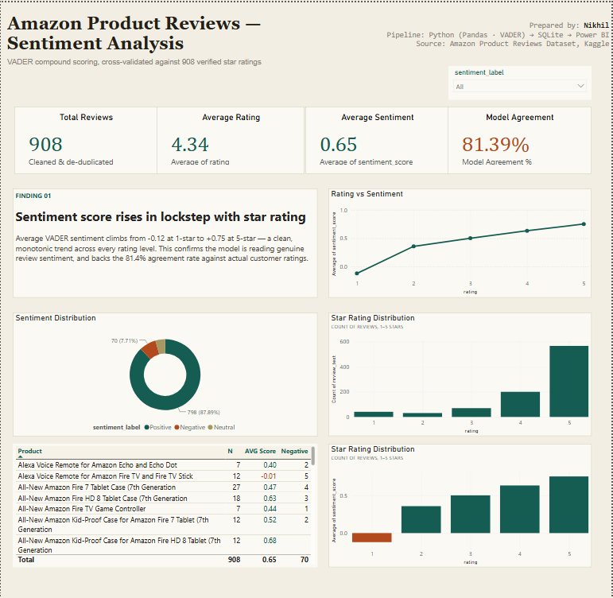

# Amazon Product Reviews — Sentiment Analysis

Sentiment analysis pipeline on Amazon product reviews, combining NLP (VADER), SQL analysis, and an interactive Power BI dashboard to uncover customer sentiment patterns and flag underperforming products.

## 📌 Problem Statement
Star ratings alone don't tell the full story — a 4-star review can carry frustration, and a 3-star review can be mostly positive. This project scores the actual review *text* for sentiment and cross-validates it against star ratings to surface real customer sentiment trends.

## 🛠️ Tech Stack
- **Python** (Pandas, VADER Sentiment, Matplotlib, WordCloud) — data cleaning & sentiment scoring
- **SQLite** — SQL-based product-level analysis
- **Power BI** — interactive dashboard & visualization

## 🔍 Approach
1. **Data Cleaning** — loaded 1,597 raw reviews, removed duplicates & nulls → 908 clean reviews
2. **Sentiment Scoring** — applied VADER to each review, generating a compound score (-1 to +1) and Positive/Negative/Neutral label
3. **Validation** — compared VADER sentiment against actual star ratings to measure model reliability
4. **SQL Analysis** — loaded cleaned data into SQLite, queried product-level sentiment trends and mismatch cases
5. **Dashboard** — built an interactive Power BI dashboard with KPIs, sentiment distribution, and product-level drilldowns

## 📊 Key Findings
- **81.4% agreement** between VADER sentiment labels and actual star ratings
- Average sentiment score rises monotonically with rating: **-0.12 (1★) → +0.75 (5★)**
- **87.9%** of reviews are Positive, 7.7% Negative, 4.4% Neutral
- Identified lowest-sentiment products (e.g. Alexa Voice Remote for Fire TV, avg. sentiment -0.01) as candidates for quality review
- Flagged rating-sentiment mismatches (e.g. high star rating but negative text) — likely sarcasm or mixed-opinion reviews

## 📁 Repository Structure
├── Notebook/ → Jupyter notebook (cleaning, VADER scoring, visualizations)
├── Data/ → raw and cleaned review datasets
├── images/ → generated charts (sentiment distribution, word cloud, correlation)
├── sql/ → SQLite database with cleaned reviews table
└── README.md

## 📈 Dashboard Preview

📥 [Download the Power BI file](Dashboard/amazon_dashboard.pbix)

## 🚀 How to Run
1. Clone this repo
2. Install dependencies: `pip install pandas vaderSentiment matplotlib wordcloud`
3. Open `Notebook/amazon_sentiment_analysis.ipynb` and run all cells
4. Open the Power BI file to explore the interactive dashboard
---
**Author:** Nikhil Garg | [LinkedIn](https://linkedin.com/in/nikhil3596) | [GitHub](https://github.com/nikhilgarg216)
